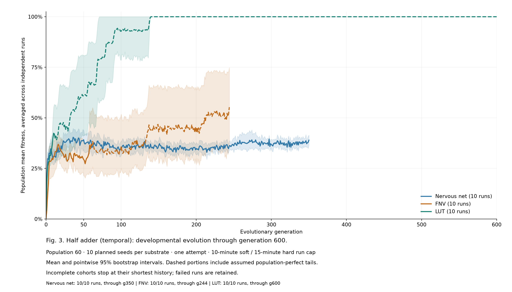

# Evolvable Hardware

A Python-based framework for evolving developmental rules that grow asynchronous
circuits and evaluating whether those circuits can perform specified tasks.

[Install and run](#install-and-run) · [Final benchmark](benchmarks/final/README.md) ·
[Run summary](benchmarks/final/runs.csv) · [Tools](tools/README.md)

## Introduction

Designing an asynchronous circuit requires consideration of both logical
behaviour and the timing of its signals. Without a global clock, circuit
behaviour depends on local signal interactions. This creates a problem for
automated circuit generation: the system needs to find components, routes, and
signal timings that produce the required output. This project investigates
whether evolutionary search of indirectly encoded circuits can address that
problem.

Rather than directly listing every connection and component of a circuit,
indirect encoding through a developmental approach allows circuit structures to
be built through local developmental rules. Edwards describes circuit ontogeny
as a process that transforms a genome into a circuit structure through growth
[1]. His work investigates circuit architectures and growth processes, while
leaving the choice of fitness functions and genetic selection to further
research. Gordon and Bentley compare two developmental systems with a direct
mapping approach and demonstrate the potential of developmental encoding, while
also showing that an effective developmental system can be difficult to design
[2].

This investigation builds on these approaches by evaluating developmental
evolution across three circuit substrates: a nervous net, a functional nervous
net (FNV), and a lookup-table (LUT) array. The nervous net and LUT array draw on
the architectures described by Edwards [1]. The LUT simulator in this project
uses asynchronous signal propagation; Edwards's original LUT architecture was
synchronous. FNV was developed for this project to investigate whether defined
functional components make useful circuit behaviour easier to evolve.

The central engineering question is which combinations of developmental rules,
circuit components, and evolutionary search settings can find circuits that
perform the required tasks. All circuit development and evaluation in this
framework are performed in software. Physical implementation remains a design
objective rather than a result established by these simulations.

## System design

The framework separates three processes:

1. **Development** applies the genome's rules over multiple iterations to grow
   the structure and component configuration of a circuit.
2. **Simulation** determines how the grown circuit responds to inputs over time.
3. **Evolution** uses the resulting fitness scores to select and change genomes
   across generations.

The main comparison uses the following substrates:

| Substrate | Structure | Circuit behaviour |
| --- | --- | --- |
| Nervous net | Hexagonal lattice | Analog excitatory and inhibitory interactions in three directional circuits per tile. |
| Functional nervous net (FNV) | Hexagonal lattice | Defined logic, delay, pulse, memory, and oscillator components. |
| Lookup-table (LUT) array | Square lattice | Four directional Boolean lookup tables per cell, simulated with asynchronous gate delays. |

The application also includes a spiking-neuron substrate (SNN), which is outside
the three-substrate benchmark described below.

In the current branched encoding, an input/output placement chromosome determines
the circuit's ports before growth. Development starts at output roots and grows
back toward the input pads. Developmental chromosomes contain rules assigned to
arms. A rule considers local cell states, its branch, and its depth, and can
apply when the context falls within its arm's evolvable matching tolerance.
The distance measure depends on the substrate. Each arm also has an evolvable
telomere that limits how many cell changes it can make during development.

The genetic algorithm evaluates populations of these genomes and produces new
generations through selection, recombination, and mutation. For the three main
substrates, selection depends on the target and configuration: logic tasks use
case-based lexicase selection, while other tasks can use tournament selection.
Fitness ranges from 0 to 1 and measures agreement with the target's specified
behaviour. The targets include
combinational logic, event timing, cadence, and memory tasks.

## Install and run

1. Download and extract the repository, or clone it.
2. Install Python 3.10 or newer, including Tkinter for the desktop interface.
3. Open a terminal in this folder and install the dependencies:

   ```sh
   python -m venv .venv
   ```

   Activate the environment on Windows:

   ```bat
   .venv\Scripts\activate
   ```

   Or on macOS/Linux:

   ```sh
   source .venv/bin/activate
   ```

   Then install and launch:

   ```sh
   python -m pip install -r requirements.txt
   python app.py
   ```

On Windows, `py` can be used instead of `python` to create the environment.
Use Command Prompt if PowerShell blocks the activation script. Linux Python
installations may need the operating system's Tkinter package (`python3-tk` on
Debian/Ubuntu). Check Tkinter with `python -m tkinter`.

After installing the dependencies, Windows users can double-click `Start.bat`.
It uses this folder's `.venv` when present, otherwise the Python on your PATH.
If startup fails, the window stays open so you can read the error.

## Using the application

Choose a substrate and target, set the population size and generation budget,
and select **Run**. Use **Pause** or **Stop** to control the run, and **Load Saved**
to reopen the saved best genome. Checkpoints and exported figures are written
to `results/` automatically.
You do not need any previously generated results to use the application.

| Tab | Purpose |
| --- | --- |
| Evolution | Follow fitness across generations and inspect the target requirements and output scores. |
| Circuit Growth | View the developmental stages and resulting circuit. |
| Activity / Voltage Traces | Examine the circuit's response over time. |
| Genome | Inspect the developmental genome. |
| Interactive | Drive the current circuit with inputs and step through its response. |
| Designer | Import and edit a circuit, grow it, simulate it, score it, and save the design. Available for Nervous and LUT. |
| Diversity | Analyse the variety in a saved population and optionally sample mutation robustness. Available for Nervous and LUT. |

Analysis tabs render when opened. Interactive loads the current solution when
you first open it after a run or checkpoint load. Designer edits remain separate
from the evolved circuit. Designer and Diversity are available for Nervous and
LUT; the other tabs support all four substrates.
The Designer can import and save current branched genomes, including their
inherited inputs and outputs. Its genome editor uses the saved fields for this
encoding. Reverse synthesis and compaction are enabled only for the older
encodings those tools support.

## Benchmarks

The [completed final benchmark](benchmarks/final/README.md) is included in this
repository, with all target graphs, raw generation histories, per-run settings,
and the archived source used to produce the results.

Exploratory benchmarks were used to investigate changes to the developmental
encoding, substrates, and genetic algorithm. A later benchmark covered 63
target names and 170 supported target/substrate combinations. Each combination
was assigned ten random seeds, a population of 60, and a maximum of 600
generations.

The benchmark planned 1,700 runs and recorded 1,692 finished attempts. Eight LUT
runs for the temporal 2x2 multiplier were skipped after the first two attempts
both timed out below generation 50. Runs could finish early when the entire
evaluated population reached fitness 1.0, or stop at a time limit. The campaign
used a 600-second time budget with a separate 900-second process limit.

These limits matter when interpreting the graphs. Curves compare population
mean fitness across runs. Any continuation after a population-perfect stop is
an assumed solved tail rather than additional measured evolution. A target
graph ends at the last solve generation when all ten runs of all three
substrates reached population-perfect fitness. Unsolved runs and time-limited
runs remain part of the reported results.

Mutation and selection settings differ between substrates and sometimes between
targets. The configuration saved with each run is the record of what was used;
current app defaults should not be substituted for historical settings. A
fitness of 1.0 on the evaluated inputs is also separate from passing held-out
tests.



Browse [all 63 target graphs](benchmarks/final/README.md#all-target-graphs), open
the [1,700-row run summary](benchmarks/final/runs.csv) in a spreadsheet, or download
the [full raw records](benchmarks/final/runs.zip). The ZIP contains 581,468 measured
generation records from the 1,692 completed runs. It preserves time-limited runs
and keeps assumed solved tails out of the raw measurements.

To verify the included data and figures:

```sh
python tools/benchmark_archive.py verify
```

The [benchmark guide](benchmarks/final/README.md#verify-or-regenerate-graphs)
explains how to extract the records and rebuild the figures without running
evolution again. The benchmark copy is not needed to launch the application.
Older experiments, intermediate population/champion checkpoints, and the derived
Excel workbook remain in the separate analysis archive.

To prepare a new benchmark from the terminal:

```sh
python benchmark.py --list-architectures
python benchmark.py --list-targets --architectures nervous,fnv,lut
python benchmark.py --architectures nervous,fnv,lut --targets "Half adder (temporal)" --seeds 3 --gens 200 --pop 60 --dry-run
```

The last command displays a proposed run without starting evolution. Remove
`--dry-run` to run it. Use `python benchmark.py --help` for output locations,
worker counts, time limits, and resume options.

## Tests

Run the automated checks from the repository root after installing the dependencies:

```sh
python run_tests.py
```

The runner does not require pytest. Interface checks need Tkinter and a desktop
session; checks that cannot open Tk return without exercising the interface.

## Files and folders

| Path | Purpose |
| --- | --- |
| `app.py` | Start the desktop application. |
| `Start.bat` | Windows double-click launcher. |
| `benchmark.py` | Run terminal benchmarks. |
| `run_tests.py` | Run the test suite without installing pytest. |
| `requirements.txt` | Python dependencies. |
| `benchmarks/final/` | Published final benchmark: all graphs, raw data, configurations, archived source, and checksums. |
| `ui/` | Desktop interface and circuit visualisation. |
| `runtime/` | Shared evolution controller, configuration, checkpoints, and workers. |
| `substrates/` | Circuit representations, developmental growth, and simulators. |
| `tests/` | Automated tests and test fixtures. |
| `tools/` | Additional maintained audit and analysis utilities. |
| `experiments/` | Historical concept/reference implementations; not needed to launch the app. |
| `results/` | Generated local output; excluded from Git. |

Additional utilities are listed in [tools/README.md](tools/README.md). The
application code stays in its packages; the root launchers provide the common
commands without duplicating implementation.

## References

[1] R. T. Edwards, "Circuit morphologies and ontogenies," in *Proc. 2002 NASA/DoD
Conf. Evolvable Hardware (EH'02)*, 2002, pp. 251-260.
doi: [10.1109/EH.2002.1029891](https://doi.org/10.1109/EH.2002.1029891).

[2] T. G. W. Gordon and P. J. Bentley, "Towards development in evolvable hardware,"
in *Proc. 2002 NASA/DoD Conf. Evolvable Hardware (EH'02)*, 2002, pp. 241-250.
doi: [10.1109/EH.2002.1029890](https://doi.org/10.1109/EH.2002.1029890).
